**

In this lab, we will lay out the absolute easiest way to begin using FPGA
resources in Kubernetes clusters. To really simplify things, we will describe
the process for enabling FPGAs in terms of the Rancher user interface. The
Rancher UI is simply a client to the Rancher RESTful APIs. You can use other
clients to the APIs, such as Golang, Python and Terraform, in GitOps, DevOps and
other automated solutions. We won’t delve into any of those here.

Fundamentally, the process is simple:

- Build out your infrastructure for a Kubernetes cluster
- Install Kubernetes
- Install the fpga-operator via Helm

## Getting Up and Running with Rancher and Available FPGA Resources

Rancher is a multi-cluster management solution that spawns Kubernetes instances
using either local or cloud resources. Recently, Amazon AWS and Microsoft Azure
made available FPGA instances to the public in order to leverage the needs for
application acceleration.

On the other hand, InAccel has developed an fpga-operator that is compatible
with all the available FPGAs in the Cloud, including Intel and Xilinx ones. The
fpga-operator performs the following:

1. Installs the right FPGA drivers
2. Instantiates the InAccel CSI and Device Plugins
3. Deploys and starts InAccel Coral Resource Manager and Coral Monitor

### FPGA drivers

InAccel performs all the checks required to install the right drivers for each
specific OS type and version.

### CSI and Device plugins

InAccel has developed a Device plugin based on the Kubernetes standard, that
works for all FPGA devices and is able to announce and keep track of all the
FPGAs of a cluster. It has also developed a CSI plugin that eases the deployment
of FPGA accelerated pods by performing any required actions regarding volumes
that have to be mounted etc.

### Coral Resource Manager and Monitor

InAccel Coral is the framework that manages, orchestrates and scales FPGA
resquests accross a cluster of available FPGA resources. InAccel Coral Monitor
is the tool for visualizing the state of each FPGA including structural
information (temperature, power etc.) as well as information about its current
configuration (loaded bitstream, number and name of the kernels, memory
connections and usage, execution time for each accelerated request etc.).

## Prerequisites

Here is the bill of materials (BOM) for getting up and running with FPGAs in
Rancher:

1. [Rancher](https://github.com/rancher/rancher/releases)
2. [InAccel FPGA Operator](https://artifacthub.io/packages/helm/inaccel/fpga-operator)
3. Infrastructure - we’ll use FPGA nodes on AWS

There is
[plenty of documentation](https://rancher.com/docs/rancher/v2.x/en/installation/)
to set up an HA installation of Rancher, so we will assume you already have
Rancher installed.

## Process Steps

### Install a Kubernetes cluster with FPGAs

With Rancher installed, we will first build and configure a Kubernetes cluster
(you can use any cluster with FPGAs.)

Under the **Global** context, we select **Add Cluster** and under the section
"With RKE and new nodes in an infrastructure provider," we select the Amazon EC2
provider.

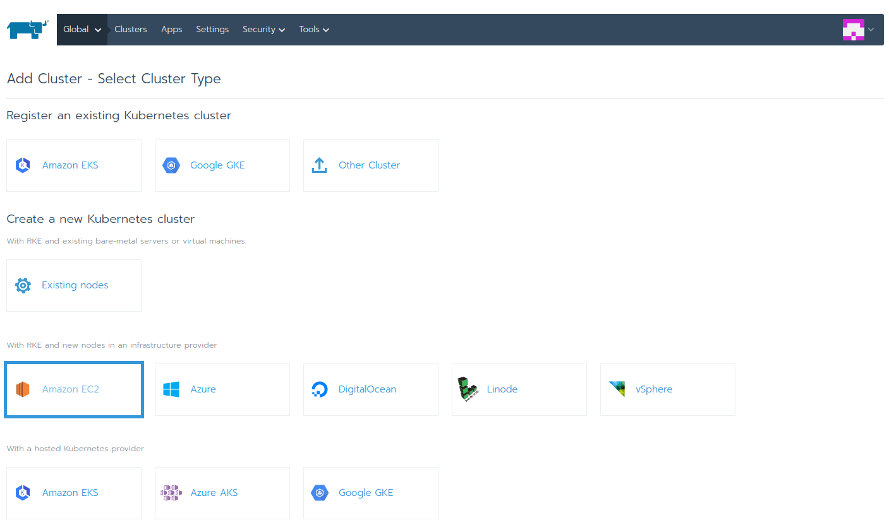

Right after, we are going to create two node pool templates: one for the master
nodes and one for the worker ones. To do so, we select the plus icon (**+**)
under the **Template** column.

The template for the **master nodes** is the following:  

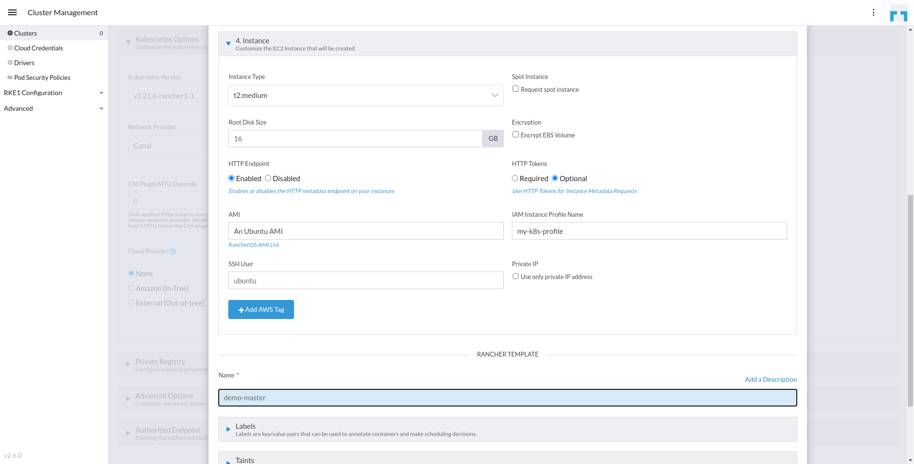

The template for the **worker nodes** (FPGA instances) is the following and is
based on the f1.2xlarge machine type that comes with a VU9P Xilinx FPGA device.
We do **NOT** need to specify a custom AMI with pre-installed FPGA drivers or
tools, since our FPGA Operator will take care of the whole system setup:  

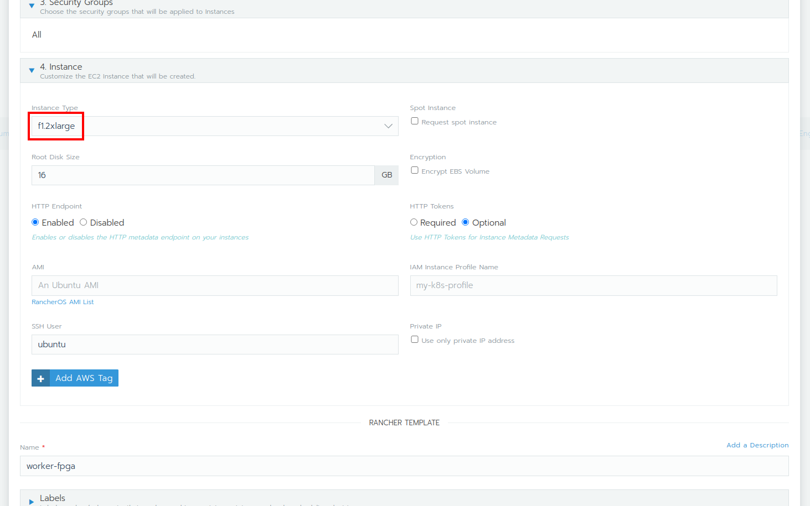

After we have finished creating the two templates we specify the nodes that will
be spawned. We choose to spawn one master and one worker node for this tutorial,
as shown below:  

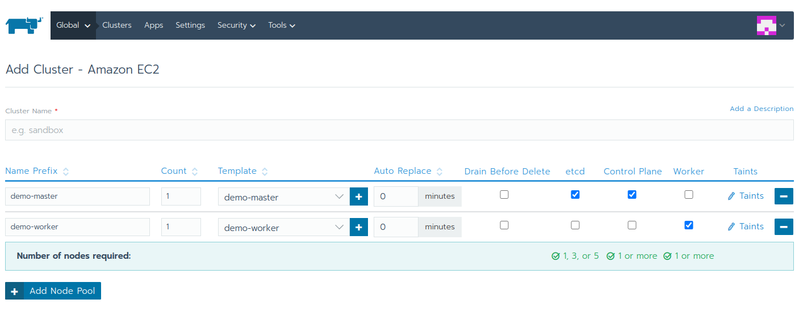

We left all other options set to the defaults. After a couple of minutes the
cluster is up and running.

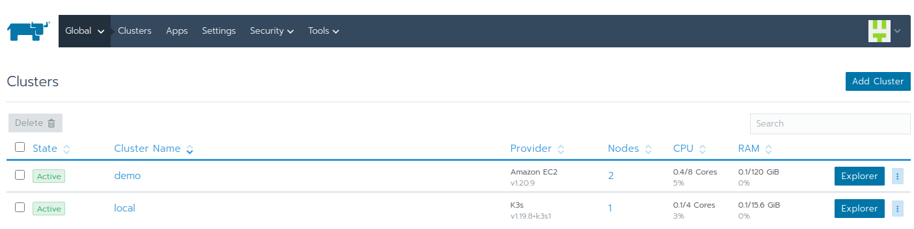

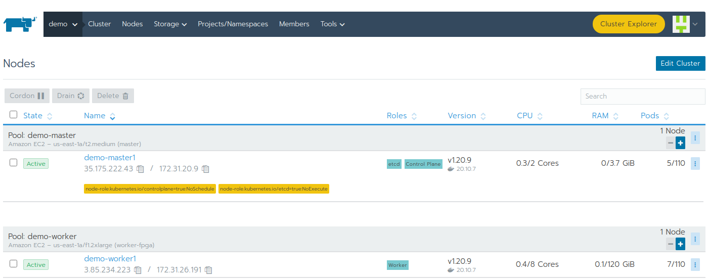

### Set Up the FPGA Operator

It is time to setup a catalog in Rancher using the
[FPGA Operator repository](https://artifacthub.io/packages/helm/inaccel/fpga-operator).

Using the Rancher **Global** context menu, we select the cluster we want to
install into

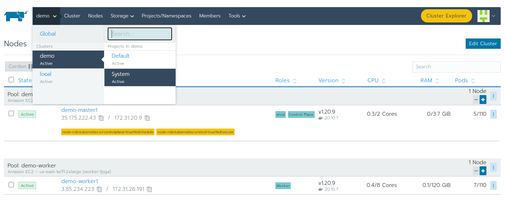

and then use the **Tools** menu to see the list of catalogs.

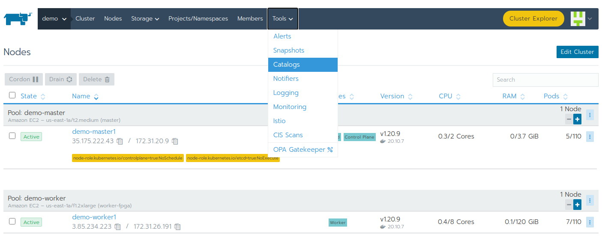

We click the **Add Catalog** button and give it a name and the URL
https://setup.inaccel.com/helm.

We have also selected **Helm v3**. We click Create to add the catalog to
Rancher.

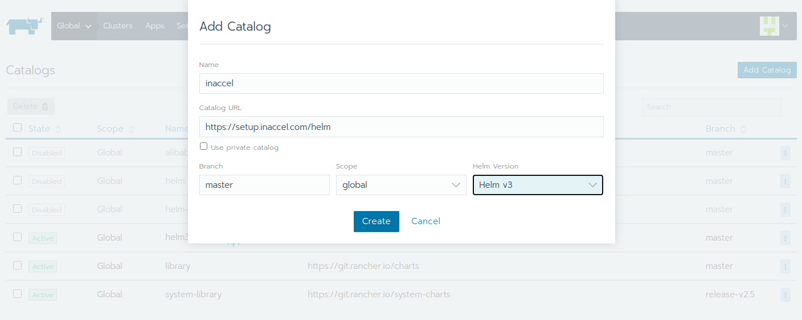

In the System project that we deployed the InAccel catalog, we select **Apps**

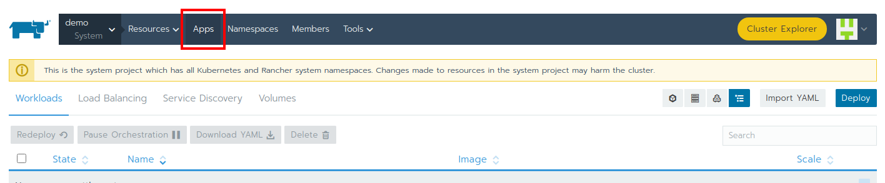

and clik **Launch** button on the right top.

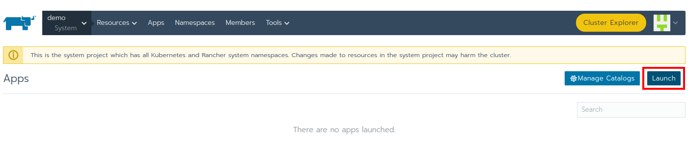

We can search for "inaccel" or scroll down to the catalog we just created.

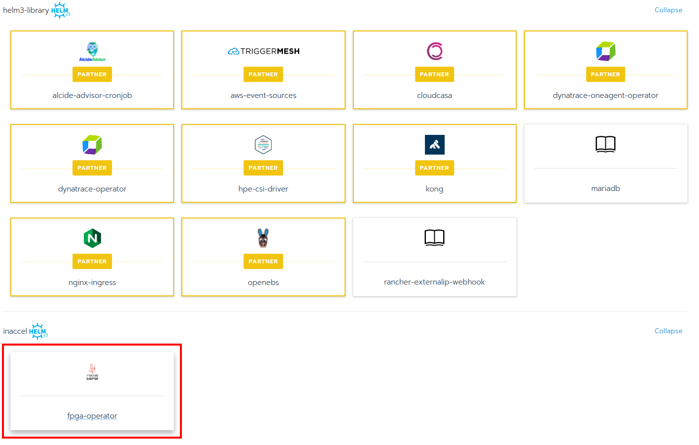

Click on the "fpga-operator" app and add your license (when using our enterprise
solution) in the Answers section as shown below, and then click **Launch**.

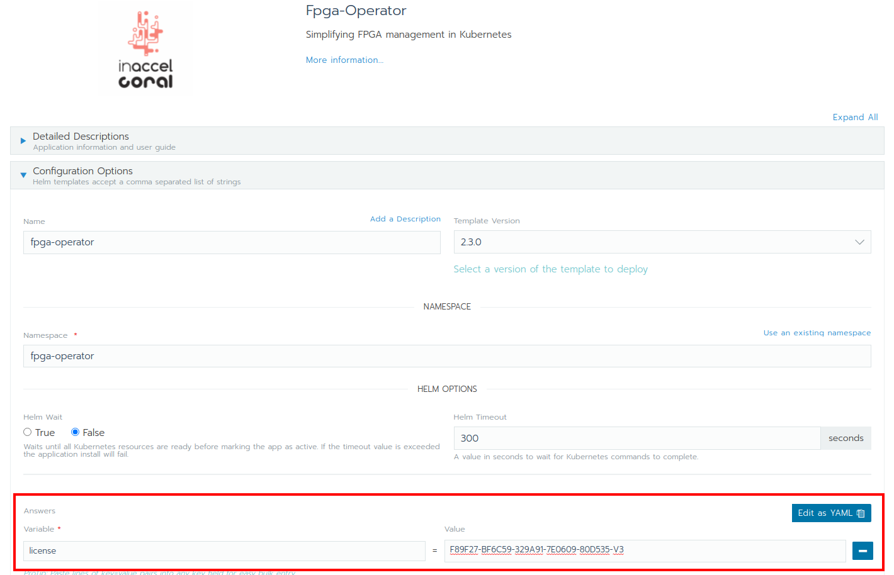

After some minutes, the APP is successfully deployed

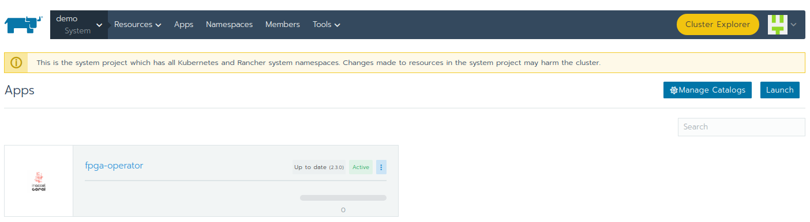

and the InAccel daemonset is deployed on all FPGA nodes (screenshot from Rancher
Cluster Explorer).

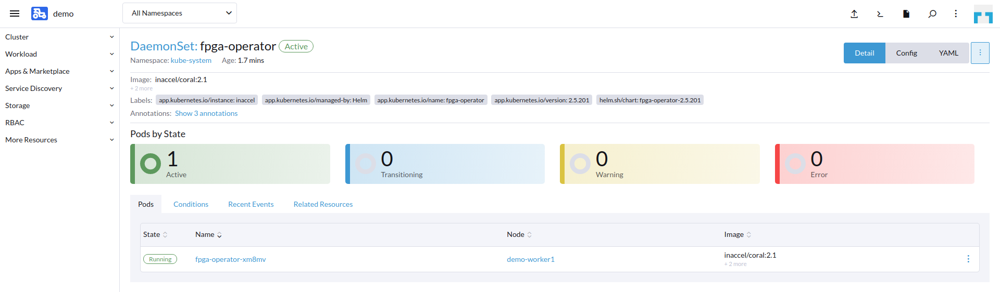

### Make use of the FPGAs

Now that FPGAs are accessible, we can deploy an FPGA-capable workload. We can
also verify that this installation was successful by looking at the cluster
details in Rancher. We see that the FPGA Operator has kindly labeled our nodes
for FPGA usage.

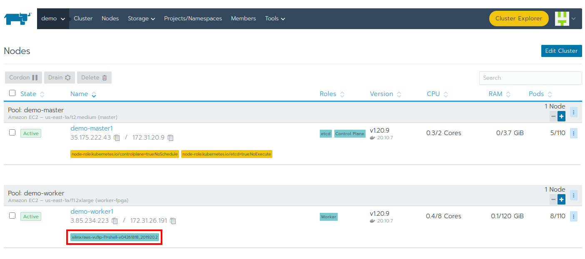

### Deploy an FPGA-Capable workload

We open the Cluster Explorer in Rancher and select **Pods** from the left menu
column. Then from the right top corner we select **Create from YAML**.

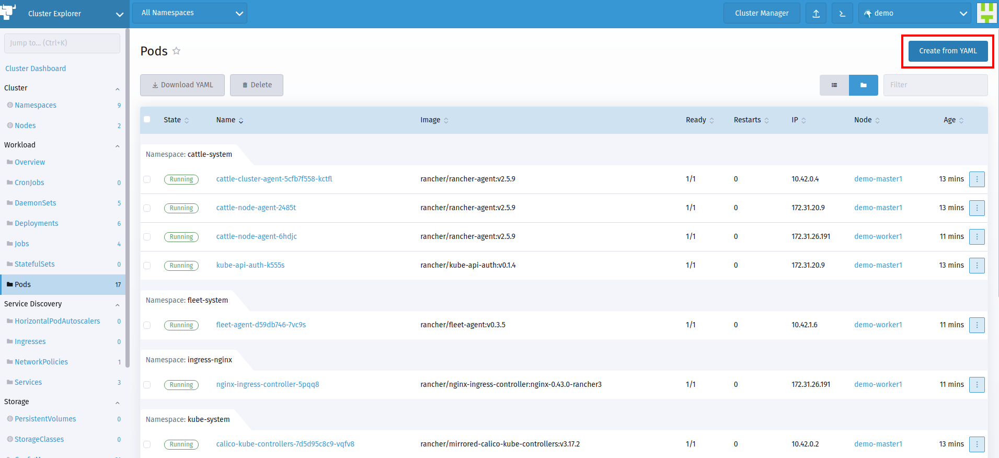

For this workload, we have already prepared a pod specification (available also
on [github](https://github.com/inaccel/vadd/blob/master/deploy/pod.yaml)) that
simply invokes a vector addition workload for FPGA acceleration:

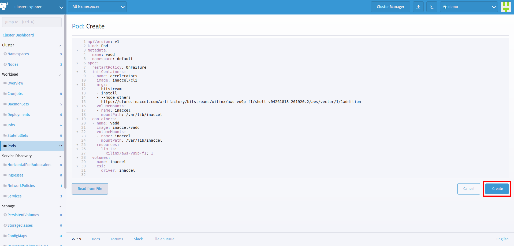

And after a couple of seconds we see that our workload has successfully ran on
the FPGA device and returned the correct results (*Test PASSED*).

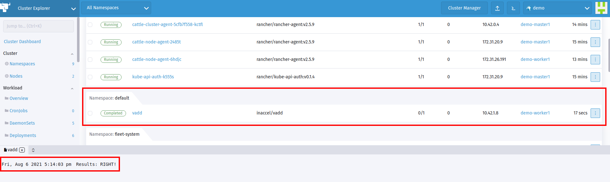

## Conclusion

This simplified approach to getting Kubernetes up and running with FPGAs takes
advantage of these two things:

- The FPGA Operator from InAccel
- Rancher’s cluster deployment and catalog app integration

